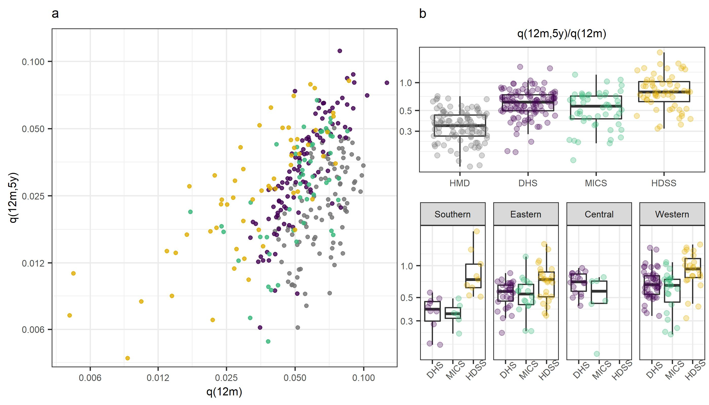

# agepatterns-u5m-demres

Code for replication of analysis for "Age patterns of under-5 mortality in sub-Saharan Africa during 1990‒2018: A comparison of estimates from demographic surveillance with full birth histories and the historic record", published in Demographic Research on March 5, 2021. Full text of the paper is available [here](https://www.demographic-research.org/volumes/vol44/18/).

To execute the analysis, run "R/master-script.R" 

If you have any questions, feel free to contact me: [hallieeilerts@gmail.com](mailto:hallieeilerts@gmail.com)

