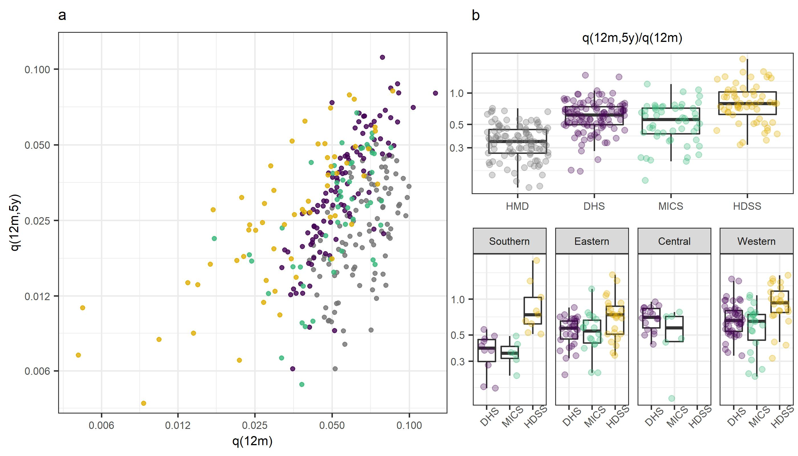
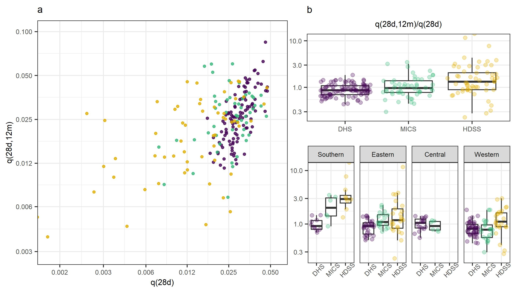
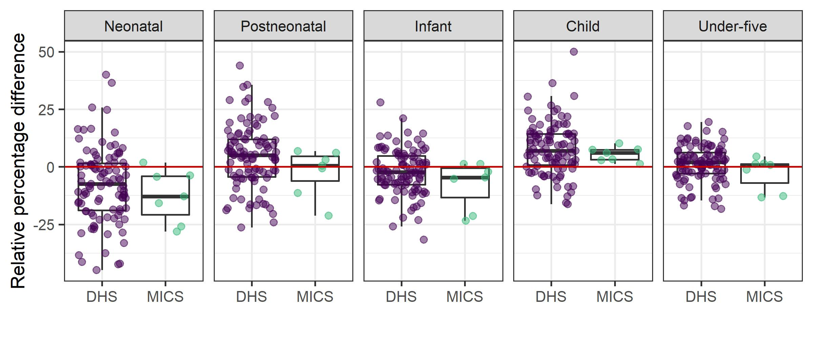

# Paper figures

## Figure 3:Age pattern of mortality under 5

Note: a: Scatter plot showing the relationship between infant and child mortality in HDSS, DHS, and MICS from sub-Saharan Africa,
and high-mortality observations from the HMD. The black solid line is the model estimate of the relationship between the two indicators,
derived from high-quality CRVS data. Dashed and dotted lines indicate model predictions under different age patterns of U5M. b: Box
plots showing the ratio of child-to-infant mortality in each source, and disaggregated by African subregion.

## Figure 2: Age pattern of mortality under 1

\small{\emph{Note:} a: Scatter plot showing the relationship between neonatal and postneonatal mortality in HDSS, DHS, and MICS from sub-Saharan
Africa. The black solid line is the model estimate of the relationship between the two indicators, derived from high-quality CRVS data.
Dashed and dotted lines indicate model predictions under different age patterns of U5M. b: Box plots showing the ratio of postneonatalto-
neonatal mortality in each data source, and disaggregated by African subregion.}

## Figure 3: HDSS-FBH differences

Note: Relative percentage differences between HDSS and DHS/MICS subnational region mortality estimates for overlapping 5-year
periods.